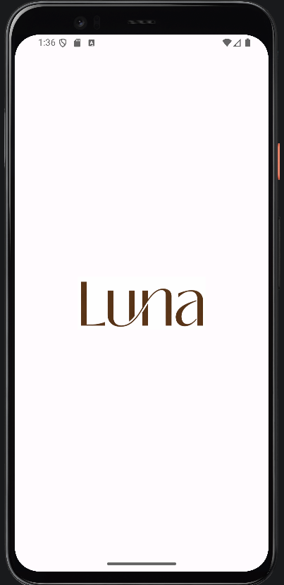
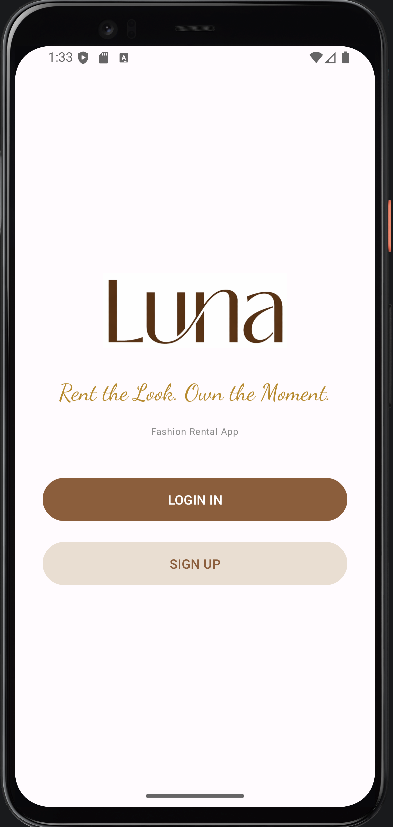
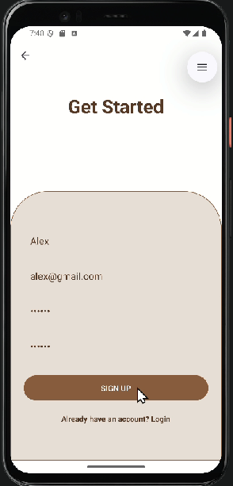
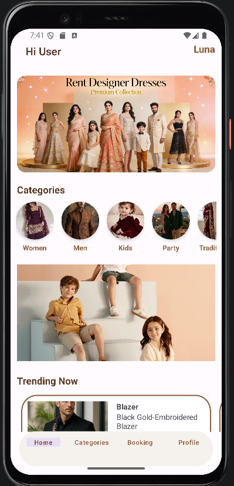
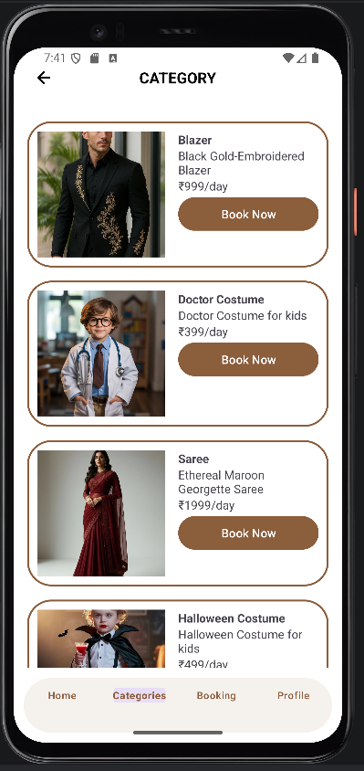
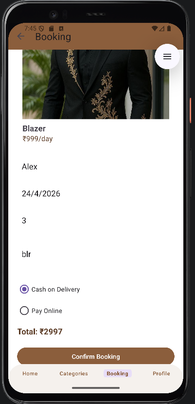
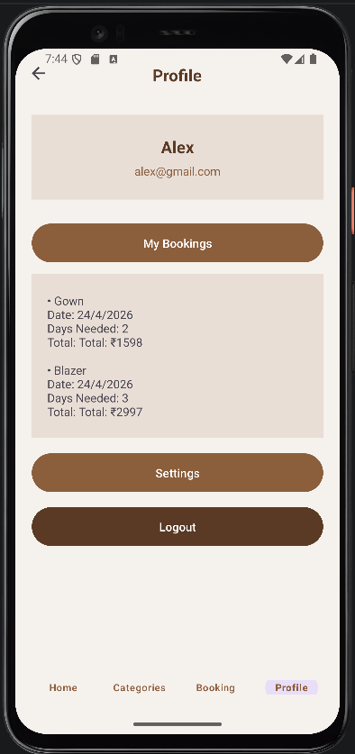
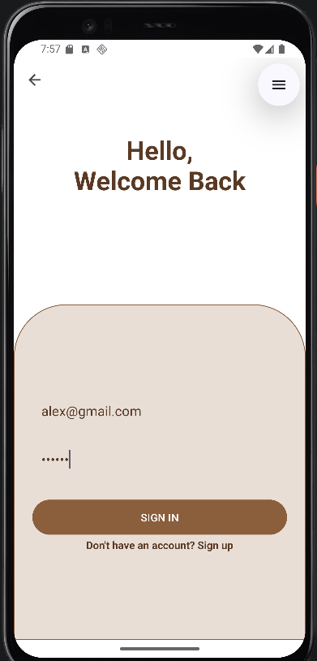

# Luna_RentalClothing_App
👗 Luna – An Android clothing rental app to browse, book &amp; rent fashion outfits for any occasion. Built with Java, XML &amp; SQLite | CMR University Mini Project

# 👗 Luna – Fashion Rental App

> *"Rent the Look. Own the Moment."*

<br>

Luna is an Android-based clothing rental application developed as a Mini Project at **CMR University, Bangalore (2025–2026)**. It allows users to browse and rent fashionable outfits for occasions like weddings, parties, and cultural events — without the burden of ownership.

---

## 👩‍💻 Developed By

| Name | USN |
|------|-----|
| Arya Nandini Gupta | 23DBCAG014 |
| Chandrika V | 23DBCAG021 |

---

## 👨‍🏫 Guided By

| Name | Designation |
|------|-------------|
| Prof. Aurangjeb Khan | Assistant Professor |
| Prof. V T Kruthika | Assistant Professor |

**School of Science and Computer Studies**
CMR University, #5 Bhuvanagiri, OMBR Layout, Bangalore – 560 043, Karnataka, India

---

## 📱 App Screenshots

| Splash Screen | Main Screen | Sign Up |
|---|---|---|
|  |  |  |

| Home | Categories | Booking |
|---|---|---|
|  |  |  |

| Profile | Login |
|---|---|
|  |  |

---

## ✨ Features

- 🔐 **User Authentication** – Secure Login & Signup using SQLite
- 🔄 **Auto Login** – Session maintained using SharedPreferences
- 🏠 **Home Screen** – Animated image slider with trending products
- 👚 **Category Browsing** – Women, Men, Kids, Party, Traditional
- 🛍️ **Product Listing** – RecyclerView with images, name & price
- 📅 **Booking System** – Date picker with auto total cost calculation
- 💳 **Payment Options** – Cash on Delivery & Online Payment
- 👤 **Profile Management** – View/edit details, booking history, logout
- 🗄️ **Local Database** – SQLite for users and booking records

---

## 🛠️ Tech Stack

| Technology | Usage |
|------------|-------|
| Java | Backend logic & activity handling |
| XML | UI layout design |
| SQLite | Local database (users & bookings) |
| SharedPreferences | Login session management |
| RecyclerView | Product listing |
| ViewPager2 | Image slider / banner |
| BottomNavigationView | App navigation |
| Android Studio | Development IDE |

---

## 📂 Project Structure

```
Luna_RentalClothing_App/
├── app/
│   └── src/
│       └── main/
│           ├── java/com/example/clothing/
│           │   ├── SplashActivity.java
│           │   ├── MainActivity.java
│           │   ├── LoginActivity.java
│           │   ├── SignupActivity.java
│           │   ├── HomeActivity.java
│           │   ├── CategoryActivity.java
│           │   ├── BookingActivity.java
│           │   ├── ProfileActivity.java
│           │   ├── DBHelper.java
│           │   ├── SliderAdapter.java
│           │   └── SimpleAdapter.java
│           └── res/
│               ├── layout/       # XML UI files
│               ├── drawable/     # Images & icons
│               ├── menu/         # Bottom nav menu
│               └── values/       # Colors, strings, themes
```

---

## 📋 Screens Overview

| Screen | Description |
|--------|-------------|
| 🌙 Splash | Animated Luna logo on launch |
| 🏠 Main | Entry point with Login / Signup |
| 🔑 Login | Email & password authentication |
| 📝 Signup | New user registration with validation |
| 🏡 Home | Banner slider + categories + trending items |
| 👗 Category | Filter and browse clothes by type |
| 📅 Booking | Select item, date, days & payment method |
| 👤 Profile | User info, booking history & settings |

---

## 🚀 Getting Started

1. **Clone the repository**
   ```bash
   git clone https://github.com/Chandrika-V04/Luna_RentalClothing_App.git
   ```
2. **Open in Android Studio**
   - File → Open → Select the cloned folder
3. **Run the app**
   - Connect an Android device or start an emulator
   - Click ▶️ Run (Shift + F10)
   - Minimum SDK: API 24 (Android 7.0)

---

## 🗄️ Database Schema

**Users Table**
```
users (fullname TEXT, email TEXT UNIQUE, password TEXT, address TEXT)
```

**Bookings Table**
```
bookings (id INTEGER PRIMARY KEY, product TEXT, price TEXT,
          date DATE, days INTEGER, address TEXT, total TEXT, payment TEXT)
```

---

## 🎯 Project Highlights

- Supports sustainable fashion by encouraging clothing reuse ♻️
- Clean brown & beige UI theme throughout the app 🎨
- Smooth navigation with BottomNavigationView 📲
- Auto total cost calculation based on rental days 💰
- Full booking history viewable in Profile 📋

---
